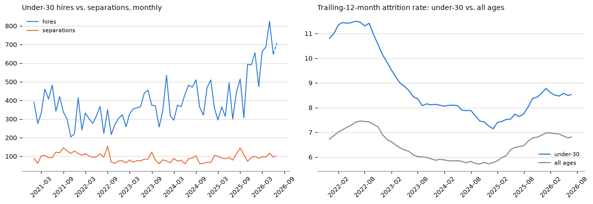

# Under-30 federal law enforcement: hiring & attrition (OPM/EHRI)

How many federal law enforcement officers are under 30, and is hiring or attrition for that group unusual right now? Built from OPM/EHRI personnel records (`impactproject/opm-ehri-data` on HuggingFace), read directly with DuckDB.

OPM has no FLEO flag, so the notebook tests three candidate definitions against BJS's census and GAO's audit of the GS-0083 series before picking one. `narrow_series` — Police, US Marshal, Criminal Investigator, General Investigator, Border Patrol, CBP Officer, Correctional Officer, any pay plan — lands within 2–7% of both. The other two miss by 70%+. Full reasoning and citations are in the notebook, §1/§1b.

As of 2026-07: about 16,000 under-30 FLEOs, 12.8% of ~125,000. Hiring in the trailing 12 months (~7,100) is up 49% year over year and already above any prior full calendar year. Attrition (8.5%) isn't elevated — under-30 officers have run about 1.2–1.6x the all-ages attrition rate every month since 2021, not just now.



## Deliverables
- `fleo_under30.ipynb` — the full analysis
- `fleo_under30_onepager.ipynb` / `.pdf` — bottom line plus one chart, code hidden

## Reproduce
```bash
pip install duckdb pandas matplotlib nbformat nbconvert jupyter huggingface_hub
python src/extract.py
python src/history.py
jupyter nbconvert --to notebook --execute --inplace fleo_under30.ipynb
jupyter nbconvert --to notebook --execute --inplace fleo_under30_onepager.ipynb

# PDF export needs Playwright's Chromium (playwright install chromium) and,
# on some installs, JUPYTER_PATH pointed at nbconvert's own templates:
JUPYTER_PATH=/opt/homebrew/share/jupyter jupyter nbconvert --to webpdf --no-input \
  fleo_under30_onepager.ipynb --output fleo_under30_onepager.pdf
```

## Layout
- `src/fleo_defs.py` — the three FLEO definitions
- `src/headline.py` — the BJS/GAO citation constants (screenshots in `sources/`) and `compute_headline()`, which both notebooks call so they can't disagree
- `src/extract.py` — 13-month pull, all three definitions
- `src/history.py` — 2021–2026 pull, `narrow_series` only
- `sources/` — screenshots of the BJS/GAO report pages the cited numbers come from
